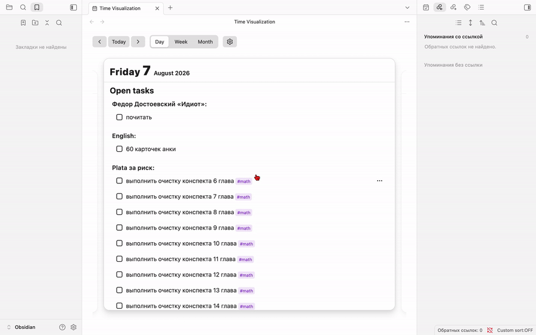

# Time Visualization


A bird's-eye view over your daily tasks: an **Obsidian plugin** that collects tasks from **many notes** into one calendar and lets you zoom smoothly between **day → week → month** views.



## The problem

Your tasks live scattered across many notes. To see what's on today, you open several files, scroll, and mentally merge them. To see the week or month — you repeat it dozens of times.

This plugin parses task lines from **all your notes** into a single index, then renders them as interactive day cards:

- **Day** — a large card with today's tasks grouped by their source note.
- **Week** — seven day cards in a row.
- **Month** — a calendar grid where each cell is a live day card.

Everything is one continuous view: switch levels with a click, page through time with the arrow keys, and toggle or edit tasks right on the card — changes are written back to the source notes.

## Features

- **Three zoom levels** — day, week and month in one continuous view; switch with a click or page with the arrow keys.
- **Parses tasks from all notes** — no manual aggregation; tasks are grouped by their source note.
- **Multiple date formats** — legacy inline fields, Obsidian Tasks (`📅`), or your own regex.
- **Edit in place** — toggle checkboxes with animation, inline-edit the text, move a task to the next day.
- **Completion order** — completed tasks keep the order they were done in across reloads (writes a `[done:: …]` marker when enabled).
- **Filters** — limit parsing to specific folders/notes and tags.
- **Open on startup** — optionally open the view automatically every time Obsidian starts.
- **Keyboard friendly** — arrow keys navigate time.

## Compatibility

- Obsidian 1.4.10+ (desktop).
- Task formats: `|[date:: YYYY-MM-DD]`, Tasks `📅 YYYY-MM-DD`, or a custom regex.

## Task format

Any standard Obsidian task line with a date (and optional time) inline field is parsed:

```markdown
- [ ] #math review chapter 4 |[date:: 2026-08-05]
- [x] #sql solve leetcode 1158 |[date:: 2026-08-05] |[time:: 09:00]
```

Rules:

- Task markers: `- [ ]` / `- [x]` (also with `*`, and inside blockquotes `> `).
- A date is required for the task to appear on a day; a time is optional and used for sorting.
- Tags (`#math`, `#sql`, …) are shown as chips; in the week/month views they are hidden to save space.
- Tasks are grouped by the note they live in; click a group name to open the note.

The date/time format is chosen in the plugin settings:

- **Inline fields** (default): `[date:: YYYY-MM-DD]` / `[time:: HH:MM]`.
- **Tasks plugin**: `📅 YYYY-MM-DD` (due) / `⏰ HH:MM` (time) — compatible with [Obsidian Tasks](https://github.com/obsidian-tasks-group/obsidian-tasks).
- **Custom regex**: your own pattern with named groups `date` and `time`, e.g. `📅 (?<date>\d{4}-\d{2}-\d{2})`. Tasks are read-only in this mode (editing and moving are disabled).

## Usage

Open the view via the ribbon icon (calendar) or the command palette: **"Open Time Visualization"**.

- **Switch levels** — header buttons: Day / Week / Month.
- **Navigate** — arrows `← →` in the day view, `↑ ↓` in the week and month views.
- **Toggle a task** — click its checkbox (animated move to/from the Done section).
- **Edit / move a task** — hover a task in the day view, click the `⋯` menu: *Edit* (inline) or *Move to next day*.
- **Go to today** — the **Today** button.

## Settings

In the plugin settings tab:

- **Sources (folders and notes)** — folders or specific note paths to parse. Empty = the whole vault.
- **Only parse tags** — show only tasks carrying any of the selected tags. Empty = all tags.
- **Date format** — inline fields (`[date:: …]`), Obsidian Tasks (`📅`), or a custom regex.
- **Record completion time** — write a `[done:: …]` marker when you complete a task, keeping the done order across reloads. Off by default.
- **Open view on startup** — open the view automatically every time Obsidian starts. Off by default.
- **Rescan** — rebuild the index with the new filters.

## Install

Copy the built `main.js`, `styles.css` and `manifest.json` into `<vault>/.obsidian/plugins/time-visualization/` and enable the plugin. Requires Obsidian 1.4.0+ (desktop).

## License

MIT
