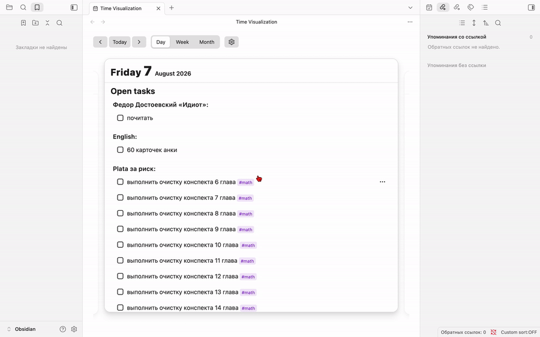

# Time Visualization


A bird's-eye view over your daily tasks: an **Obsidian plugin** that collects tasks from **many notes** into one calendar and lets you zoom smoothly between **day → week → month** views.



## The problem

Your tasks live scattered across many notes. To see what's on today, you open several files, scroll, and mentally merge them. To see the week or month — you repeat it dozens of times.

This plugin parses task lines from **all your notes** into a single index, then renders them as interactive day cards:

- **Day** — a large card with today's tasks grouped by their source note.
- **Week** — seven day cards in a row.
- **Month** — a calendar grid where each cell is a live day card.

Everything is one continuous view: switch levels with a click, page through time with the arrow keys, and toggle or edit tasks right on the card — changes are written back to the source notes.

## Features

- **Three zoom levels** — day, week and month on desktop; mobile shows the day view only.
- **Parses tasks from all notes** — no manual aggregation; tasks are grouped by their source note.
- **Multiple date formats** — legacy inline fields, Obsidian Tasks (`📅`), or your own regex.
- **Edit in place** — toggle checkboxes with animation, inline-edit the text, move a task to the next day. Done keeps completion order: consecutive tasks from the same note stay together, but completing another note in between starts a new group; completion time is shown when “Record completion time” is on.
- **Clickable links** — `[[wiki links]]` and bare `https://…` URLs open without toggling the task; Ctrl/Cmd+hover uses Page Preview like note titles.
- **Completion order** — when enabled, on completion the `[date:: …]` field becomes a `[done:: …]` marker, so completed tasks keep their order across reloads.
- **Group priorities** — ordered list of notes or folders in Settings (folders cover notes inside them), or reorder a day's groups from the day header.
- **Time over priority** — optional setting: timed task groups sort above untimed ones.
- **Day clock** — a 12-hour dial on the day view. Morning tasks draw on the inner ring (00:00–12:00), afternoon tasks on the outer ring (12:00–24:00). A single time is a short mark; a range such as `09:00-10:30` is an arc. On today, hour, minute and second hands move like a real clock, and a red stripe marks the current time. Hover an arc to see the task.
- **Timed tasks beside the clock** — while the clock is open, tasks with a time leave Open tasks and sit next to the dial. Checking them off uses the same strikethrough and move-to-Done animation. If Timed tasks is empty, Open tasks takes that place; if Open tasks is empty too, Done does. A row stays in the column beside the dial only while it would overlap the face. Once it clears the clock, with a small gap, it runs the full width. The divider between blocks never sits above the bottom of the dial.
- **Notes filter** — the header **Notes** button limits day, week and month to selected notes. Notes that have no dated tasks are not listed.
- **Filters** — limit parsing to specific folders/notes and tags.
- **Open on startup** — optionally open the view automatically every time Obsidian starts.
- **Keyboard friendly** — arrow keys navigate time.

## Compatibility

- Obsidian **1.4.10+** (desktop and mobile).
- **Mobile** — day view only (week/month stay desktop).
- Task formats: `|[date:: YYYY-MM-DD]`, Tasks `📅 YYYY-MM-DD`, or a custom regex.

## Task format

Any standard Obsidian task line with a date (and optional time) inline field is parsed:

```markdown
- [ ] #math review chapter 4 |[date:: 2026-08-05]
- [x] #sql solve leetcode 1158 |[date:: 2026-08-05] |[time:: 09:00]
```

Rules:

- Task markers: `- [ ]` / `- [x]` (also with `*`, and inside blockquotes `> `).
- A date is required for the task to appear on a day; a time is optional and used for sorting.
- A time may be a point (`09:00`) or a range (`09:00-10:30`, also an en dash or em dash). A range that passes midnight stays on the start day. The day clock draws points as short marks and ranges as arcs.
- Tags (`#math`, `#sql`, …) are shown as chips; in the week/month views they are hidden to save space.
- Tasks are grouped by the note they live in; click a group name to open the note.

The date/time format is chosen in the plugin settings:

- **Inline fields** (default): `[date:: YYYY-MM-DD]` / `[time:: HH:MM]`.
- **Tasks plugin**: `📅 YYYY-MM-DD` (due) / `⏰ HH:MM` (time) — compatible with [Obsidian Tasks](https://github.com/obsidian-tasks-group/obsidian-tasks).
- **Custom regex**: your own pattern with named groups `date` and `time`, e.g. `📅 (?<date>\d{4}-\d{2}-\d{2})`. Tasks are read-only in this mode (editing and moving are disabled).

## Usage

Open the view via the ribbon icon (calendar) or the command palette: **"Open Time Visualization"**.

- **Switch levels** — header buttons: Day / Week / Month (desktop). On mobile only the day view is available.
- **Navigate** — arrows `← →` in the day view, `↑ ↓` in the week and month views.
- **Toggle a task** — click its checkbox (animated move to/from the Done section).
- **Edit / move a task** — hover a task in the day view (desktop), click the `⋯` menu: *Edit* (inline) or *Move to next day*. Not available on mobile.
- **Priority for a day** — hover the day header (desktop), click **Priority**, reorder notes with ↑/↓. You can rearrange notes inside a priority folder or move a note above/below other groups for that day. Not available on mobile.
- **Day clock** — hover the day header and click the clock icon (on mobile the button stays visible). The dial sits on the right; timed tasks sit on the left. Click the icon again to close it and return those tasks to Open tasks. Completed arcs stay pale even while their range is still current.
- **Filter notes** — the **Notes** button in the header. Tick notes, or **All notes** to clear the filter. One selected note shows its name on the button; several show `Notes (n)`. Scroll the popup with the mouse wheel.
- **Go to today** — the **Today** button.

## Settings

In the plugin settings tab:

- **Sources (folders and notes)** — folders or specific note paths to parse. Empty = the whole vault.
- **Only parse tags** — show only tasks carrying any of the selected tags. Empty = all tags.
- **Date format** — inline fields (`[date:: …]`), Obsidian Tasks (`📅`), or a custom regex.
- **Record completion time** — on completion the `[date:: …]` field is replaced with a `[done:: …]` marker, keeping the done order across reloads. If you uncheck a task outside this view, the `[done:: …]` marker stays in the line — it is restored to `[date:: …]` when you toggle the task in the view. Off by default.
- **Cut the time range when completed early** — if you check a task while its scheduled range is still running, the end is rewritten to that minute. `[time:: 18:00-22:00]` checked at 19:30 becomes `[time:: 18:00-19:30]`. Point times and ranges that have already ended are left as written. Unchecking does not restore the old end. Off by default, and independent of “Record completion time”.
- **Open view on startup** — open the view automatically every time Obsidian starts. Off by default.
- **Priority** — ordered list of notes or folders; first = highest. A folder covers notes inside it; list a specific note above that folder to pin it higher than its siblings. A per-day order of individual notes can be set from the day header's Priority button.
- **Time over priority** — when on, groups with timed tasks sort above untimed groups.
- **Rescan** — rebuild the index with the new filters / date format.

## Install

Copy the built `main.js`, `styles.css` and `manifest.json` into `<vault>/.obsidian/plugins/time-visualization/` and enable the plugin. Requires Obsidian **1.4.10+** (desktop and mobile; mobile is day view only).

From Community Plugins (when listed): search for **Time Visualization** and install.

## Development

```bash
npm install
npm run dev      # watch build (styles + main.js)
npm run build    # production build + typecheck
npm test         # unit tests (Vitest)
npm run test:watch
```

- Edit TypeScript under `src/`.
- Edit CSS under `styles/` (section files listed in `styles/order.txt`). Do **not** hand-edit root `styles.css` — it is generated by `styles-build.mjs` on `dev` / `build` / `npm run styles`.
- Pull requests run CI (`npm test` + `npm run build`) via GitHub Actions.
